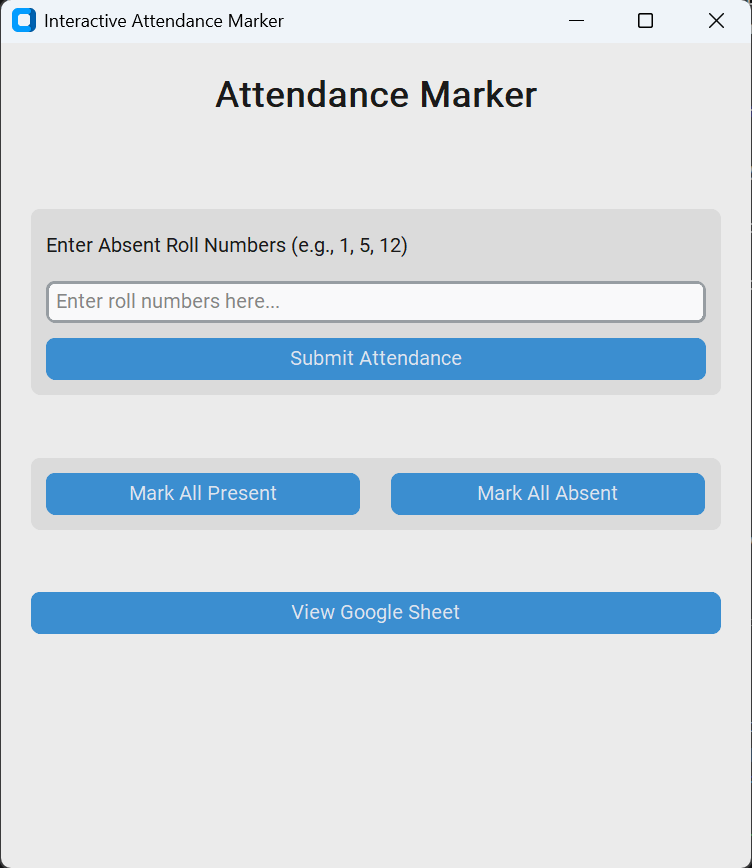

Attendance Marker - Google Sheets GUI
An interactive Python desktop application for easy attendance marking via Google Sheets.

✨ Features
🗂️ Mark attendance with a modern CustomTkinter GUI

✅ Mark all present/absent or specify absent roll numbers

🔄 Google Sheets integration (real-time updates)

⚡ Fast, responsive, and beginner-friendly

🌐 View Google Sheet with one click

🚀 Quick Start
Clone the repository

Add your Google service account JSON file (rename it for safety!)

Share your Google Sheet with the service account email

Install requirements

bash
pip install -r requirements.txt
Run the app

bash
python microproject20.py
📦 Requirements
Python 3.7+

gspread

customtkinter

oauth2client

📎 Notes
Keep your credentials JSON file safe.

See .gitignore for recommended exclusions.

